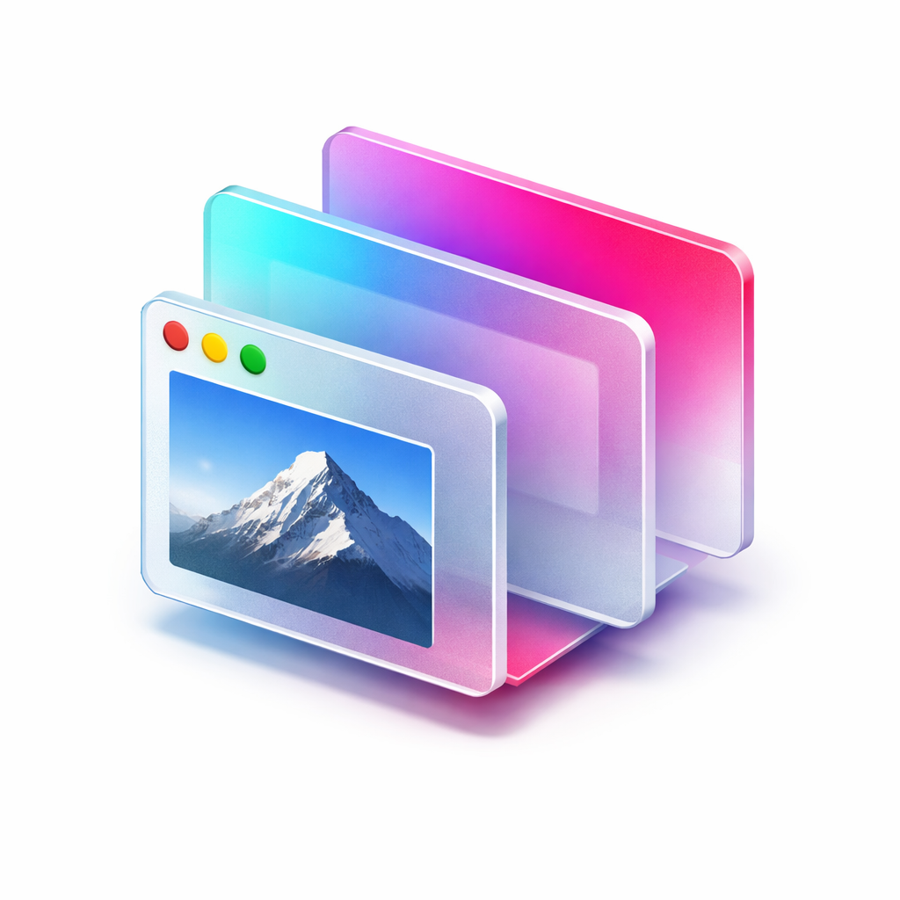
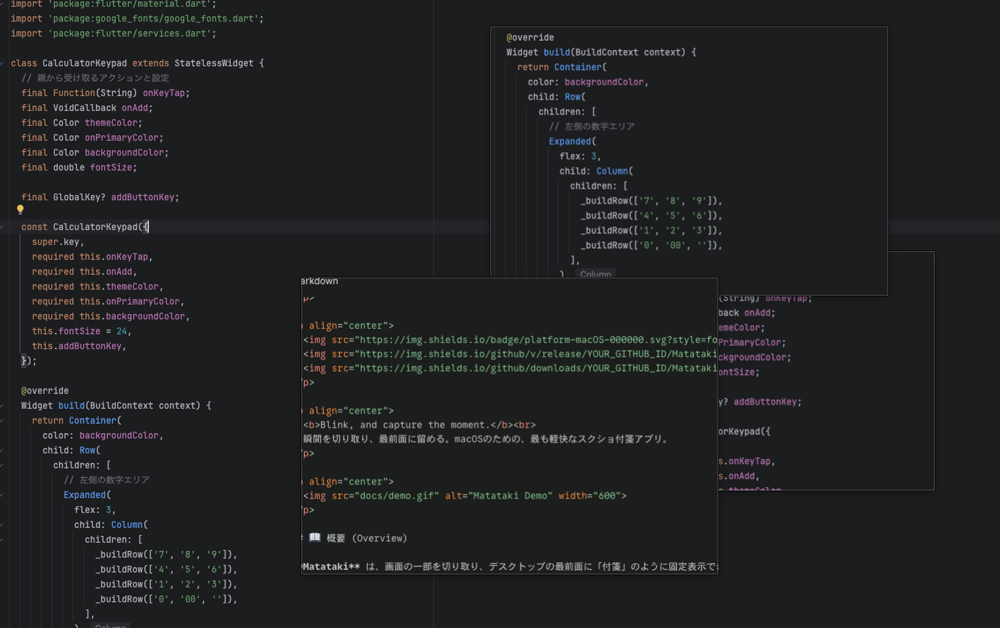

# Matataki

  

  
  
  

  <b>Blink, and capture the moment.</b> 
  瞬間を切り取り、最前面に留める。macOSのための、最も軽快なスクショ付箋アプリ。

  

  

## 📖 概要 (Overview)

**Matataki** は、画面の一部を切り取り、デスクトップの最前面に「付箋」のように固定表示できるユーティリティアプリです。

* **対応OS:** macOS 14.6 (Sonoma) 以降
* **対応チップ:** Apple Silicon (M1/M2/M3) & Intel

Windowsで愛用された「SETUNA」のような使用感を、現代のmacOSネイティブな技術（Swift & TCA）で再現・進化させました。
デザインの参考、コードの模写、情報の比較など、あらゆる作業の効率を劇的に向上させます。

## ✨ 特徴 (Features)

* **⚡️ 常時最前面 (Always on Top):** キャプチャした画像は、常に他のウィンドウより手前に表示されます。
* **🖥 マルチモニター完全対応 (Multi-Monitor):** 異なる解像度のモニター間でも、ズレることなく快適にキャプチャ・移動が可能です。
* **🤏 吸い付く最小化 (Focus Minimize):** ダブルクリックでアイコン化。マウスカーソルの位置に吸い付くように最小化されるため、作業の視線を切らしません。
* **👻 直感的な透明化 (Smart Opacity):** 画像の上で**マウスホイール（スクロール）**するだけで、透明度をサクサク調整。下の情報を透かして見ることができます。
* **🛡️ Apple公証済み (Notarized):** Appleによる公証を受けているため、セキュリティ警告なしで安全に起動できます。

## 📥 ダウンロードとインストール

[👉 **最新版のダウンロード (Releases)**](https://github.com/kentarogawa/matataki-public/releases)

1. 上記リンクから最新の `Matataki.zip` をダウンロードします。
2. 解凍して出てきた `Matataki.app` を **「アプリケーション」フォルダ** に移動します。
3. ダブルクリックして起動してください。
4. タスクバーに常駐しますので、環境設定からログイン時の起動とショートカットキーの設定をおこなってください。

> **Note:** 初回起動時、画面収録の許可を求めるポップアップが表示された場合は「許可」を選択してください。（キャプチャ機能に必須のため）

## 🎮 操作方法 (Controls)

| 操作          | アクション                     |
|:------------|:--------------------------|
| **キャプチャ**   | ウィンドウのキャプチャ（ショートカットキーで起動） |
| **ドラッグ**    | ウィンドウの移動        |
| **スクロール**   | 透明度の変更 (透過 / 不透過)         |
| **ダブルクリック** | 最小化 / 復元                  |
| **Cmd + C** | 画像をクリップボードにコピー            |
| **Cmd + X** | コピーしてウィンドウを閉じる            |
| **Esc**     | ウィンドウを閉じる                 |
| **メニューバー**  | アプリの終了、ショートカットキー設定の確認     |

## 💬 サポート・不具合報告 (Support)

バグ報告や機能要望はGitHub Issuesにて受け付けています。
お気づきの点があれば、お気軽に投稿してください。

[🐛 不具合報告・要望はこちら (New Issue)](https://github.com/kentarogawa/matataki-public/issues)

## 🔐 プライバシーとセキュリティ (Privacy)

* **画面収録権限:** 選択した範囲のスクリーンショットを撮影するためにのみ使用されます。
* **ネットワーク通信:** 本アプリはオフラインで完全に動作します。キャプチャした画像データが外部サーバーに送信されることは一切ありません。

## 📄 ライセンス (License)

**Matataki** is freeware.
本アプリは無料で使用できますが、再配布や販売、リバースエンジニアリングは禁止します。

Copyright © 2025 kentarogawa. All rights reserved.

---

  Created by <a href="https://github.com/kentarogawa">@kentarogawa</a>

